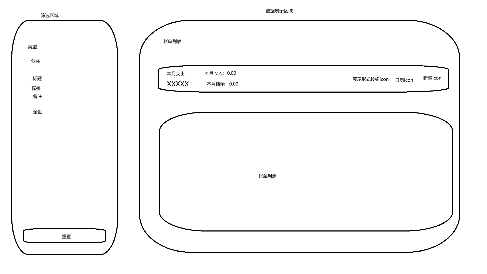
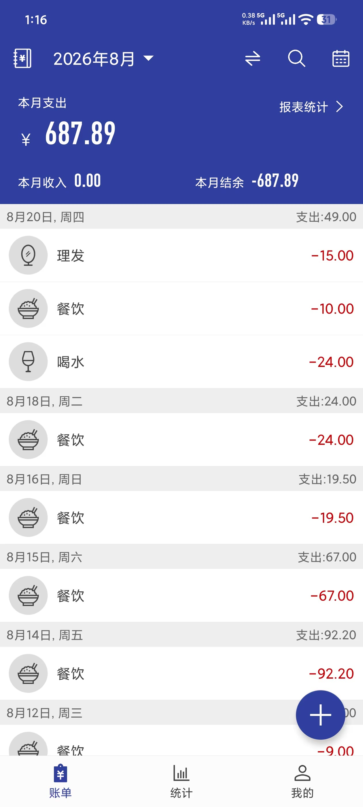

现在讨论接口相关的业务逻辑：
接口只有四个：查询记录，创建记录，编辑记录，删除记录没有问题吧。因为有些接口如果不把交互讲清楚，你可能会觉得这个逻辑怎么这么奇怪，所以我把后端业务逻辑和前端交互逻辑一起说，到时候你自己拆开。

## 查询记录

### 筛选条件：

- 类型：支出/收入，下拉列表，展示勾选的值。只能单选，在已有勾选值的情况下，勾选另一个会自动取消之前勾选的值，亦或者勾选了一个值再点击它则会取消勾选。不勾选的情况下 支出和收入的记录一起返回。默认不选
- 展示形式，这个非常关键，影响前端展示。前端就是一个按钮，为日形式展示时，显示月icon，点击切换为月形式展示，当为月形式展示时，显示日icon，点击切换为日形式展示，默认为日形式展示。
  - 月：输入年份，查询该年的记录并且以月为基本单位展示，按照日期升序排序。比如查询2025年的记录，返回给前端1~12月的记录[1月，2月，3月...]，其中每月的数据不是依次展示该月下每日的记录，而是该月所有记录按分类的结果汇总。大致结构如下：

    ```jsonc

    '某月':{
    '支出：'[
        {
            '一类1':'xxx'
            '一类1在该月的总金额':'xxx'
            '子类':[
                {
                    '子类1':'xxx，'
                    '子类1在该月的总金额':'xxx'
                },
                {
                    '子类2':'xxx，'
                    '子类2在该月的总金额':'xxx'
                },
                ...
                ]
        },
        {
            '一类2':'xxx'
            '一类2在该月的总金额':'xxx'
            '子类':[
                {
                    '子类1':'xxx，'
                    '子类1在该月的总金额':'xxx'
                },
                {
                    '子类2':'xxx，'
                    '子类2在该月的总金额':'xxx'
                },
                ...
                ]
        },
        ...

    ]
    '收入：'结构跟支出一致，但是收入只有一级分类，所以区别就是没有子类数组'
    }。
    ```
        简单来说以月为基本单位形式展示的数据是汇总性质的，每条记录的细节如标签、title、remark都不会展示，点击标题展开/关闭记录。
        ```
        元素布局如下：


        ——————————————————————————————————————————
        1月                     收入：xxx 支出：xxx             => 标题
        ——————————————————————————————————————————
        支出                                            =》支出板块
        ——————————————————————————————————————————
        icon 一级分类1name                     金额     =》一级分类
        __________________________________________
        icon 二级分类1name                     金额      =》二级分类
        ——————————————————————————————————————————
        icon 二级分类2name                     金额
        ——————————————————————————————————————————
        icon 一级分类2name                     金额     =》一级分类
        __________________________________________
        icon 二级分类1name                     金额      =》二级分类
        ——————————————————————————————————————————
        icon 二级分类2name                     金额
        ——————————————————————————————————————————

        ——————————————————————————————————————————
        收入                                   金额         =》收入板块
        __________________________________________
        icon 一级分类1name                     金额
        __________________________________________
        ```
        前端依次1月，2月，...；卡片结构大致为：
        顶部标题：左侧显示月份如1月，右侧显示收支金额详情，依次为收入：xxx  支出：xxx
        内容区域：点击1月下拉展开内容区域支出和收入两个板块，支出在上收入在下。支出依次展示每个一级分类的icon、名称以及总金额，icon和名称在左侧，金额在右侧。点击一级分类又会下拉展示每个二级分类的icon、名称、金额。收入板块同理，但是收入只有一级分类。。
        元素样式：
        标题有背景色，背景色要符合项目主题。
        金额如果是收入用红色字体，如果是支出用绿色字体。
        支出和收入两个板块的标题处的支出、收入字体要偏小一些，灰色。
  - 日：输入月份，查询该月的记录并且以日为基本单位展示，按照日期升序排序。比如查询2026年8月的记录，返回给前端1~31的记录[1日，2日，...]，其中每日数据就是金额记录表里所记录的详细内容了，标签、title、remakr都会展示，系统初始默认就是以日为展示形式，且展示当月的记录。大致结构如下：
    
    ```
      ——————————————————————————————————————————————————————————————————
      20日，周四                                      收入：xxx 支出：xxx                                  => 标题
      ——————————————————————————————————————————————————————————————————
      icon 一级分类name - 二级分类name title            备注icon 金额xxx 操作icon                                 =》 一笔消费
          标签icon，标签icon，...
      __________________________________________________________________
      icon 一级分类name - 二级分类name title            备注icon 金额xxx 操作icon                                  =》 一笔消费
          标签icon，标签icon，...
      __________________________________________________________________
      —————————————————————————————————————————————————————————————————
      21日，周五                                      收入：xxx 支出：xxx
      —————————————————————————————————————————————————————————————————
      icon 一级分类name - 二级分类name title            备注icon 金额xxx 操作icon
          标签icon，标签icon，...
      ___________________________________________________________________
    ```
    样式和交互：
    1.点击标题展开/关闭当日的详细记录。
    2.布局：最左侧为该笔记录的icon(我不确定放一级还是二级icon比较好，你提供一下建议)，后面为依次分类和title(没有则不展示)、标签icon(没有icon则不展示)。分类和title与标签icon为整体一起垂直居中，所以当没有标签时，分类与title仍然要垂直居中，不过上限间距看上去就更宽了。
    3.一笔记录有几个标签就展示几个标签icon，鼠标hover查看标签内容
    4.当记录存在备注时展示icon没有则不展示，位置位于金额左侧，鼠标hover查看备注内容
    5.金额如果是收入用红色字体，如果是支出用绿色字体。

    之前金额表好像没有存入每笔消费的实际发生事件的星期，这个要补上


- 日期
  前端展示为日历图标，当前端的展示形式是月时，日历为月份选择器，当展示形式为日时，日历为日期选择器。我不太清楚选择器时弄成单个、还是区间、还是多选，你提供一些意见

- 分类
  多选的级联选择器。可以在分类名称前面加上icon吗，我不确定是否能做到
- 标题
  input框，搜索title内容
- 标签
  input框，搜索标签内容
- 备注
  input框，搜索标签内容
- 金额
    两个input框，分表表示最小值和最大值。可通过最小值、最大值、区间三种情况查询金额记录

注意：标题的支出/收入会根据类型是否展示。如勾选了支出，则收入就不展示

## 创建记录
### 创建一条
前端点击新增按钮弹出弹窗来创建记录，弹窗内容如下：
标题：新增记录，右侧有关闭按钮
内容，为表单域：
类型：支出/收入，单选按钮，样式同筛选为一个圆角矩形框，必填，默认值为支出
分类：单选级联选择器，下拉列表为用户的所有分类，必填
金额：input框，必填
标题：input框，非必填
标签：input框，非必填
备注：input框，非必填
底部：取消和确认按钮
要求：
1. 必填项需要有必填校验以及没有填写时的提示
2. 创建成功后关闭弹窗。无论以什么形式关闭弹窗，再次打开都需要重置之前的表单内容
### 批量创建
这个涉及到录入模板，下一个版本再添加

## 编辑记录
点击编辑按钮弹出编辑弹窗，弹窗回显所有内容，弹窗交互、样式跟创建记录类似。除了金额类型不允许编辑外，其他字段都可以编辑，并且字段的必填性质跟创建记录一致。

## 删除记录
### 删除一条
点击删除按钮，弹出二次确认弹窗：确定要删除该条记录吗？只需要传递记录id给后端即可
### 批量删除
下一版再添加

## 账单列表页参考图

下面这张是移动端的图，但是没关系，只是给你看看大概的风格、布局


草图既是我想要的画面，大概说明一下：
1. 操作icon只会在每笔记录的末尾展示，所以以月形式展示时不会展示，鼠标hover操作icon显示编辑icon和删除icon
2. 新增只需要展示icon，不需要像分类、标签管理那样显示文字
3. 筛选区域只要修改筛选条件就触发，所以没有确认按钮。不过要做限制放置高频请求
4. 本月支出的金额值需要很大并且加粗
5. 本月收入同样使用红色字体，结余如果是负的展示绿色字体-xxx，正的则是红色字体xxx。这个项目的风格是支出为绿色收入为红色是为了跟金融方面对齐，但是我觉得好像还是收入为绿色支出为红色比较好，你有没有什么意见