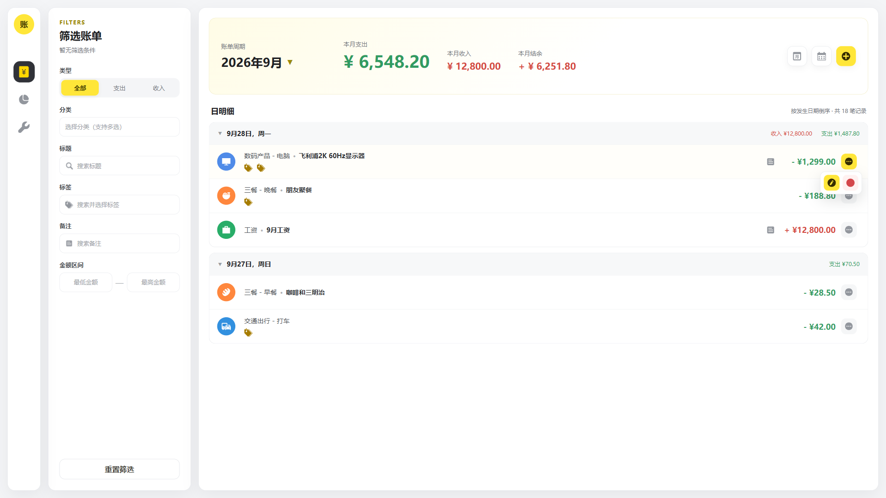

## 流水

一笔支出或收入即为一条流水记录。流水记录必须属于一个用户，并绑定一个符合收支类型和分类层级要求的用户分类；标签不是必填项，一条流水记录可以绑定多个标签。

第一版只记录金额实际发生的日期，不记录具体时分秒。流水记录的发生日期、创建时间和更新时间含义不同：

- `occurred_date` 表示该笔支出或收入实际发生的日期，用于按日、月、年展示和统计账单；
- `created_time` 表示该流水被录入系统的时间；
- `updated_time` 表示该流水最后一次被修改的时间。

## 流水记录表

transactions

| 字段          | 类型与要求                                                              | 说明                                                     |
| ------------- | ----------------------------------------------------------------------- | -------------------------------------------------------- |
| id            | INT AUTO_INCREMENT PRIMARY KEY                                          | 流水记录主键                                             |
| owner_user_id | INT NOT NULL，FK -> users.id，ON DELETE RESTRICT                        | 所属用户id                                               |
| type          | VARCHAR(20) NOT NULL，取值仅限 expense / income                         | 流水类型；expense表示支出，income表示收入                |
| amount        | DECIMAL(15,2) NOT NULL，值必须大于0                                     | 金额绝对值，最多保留两位小数                             |
| category_id   | INT NOT NULL，FK -> user_category.id，ON DELETE RESTRICT                | 支出绑定二级分类，收入绑定一级分类                       |
| title         | VARCHAR(50) NULL                                                        | 流水标题，用于说明该笔流水的具体内容                     |
| remark        | VARCHAR(100) NULL                                                       | 补充说明，例如优惠、价格异常或其他可能影响后续对账的信息 |
| occurred_date | DATE NOT NULL                                                           | 该笔支出或收入实际发生的日期                             |
| archived_time | DATETIME NULL                                                           | 逻辑删除时间，NULL表示未删除                             |
| created_time  | DATETIME NOT NULL DEFAULT CURRENT_TIMESTAMP                             | 流水录入时间                                             |
| updated_time  | DATETIME NOT NULL DEFAULT CURRENT_TIMESTAMP ON UPDATE CURRENT_TIMESTAMP | 流水最后修改时间                                         |

流水记录表不保存 `tag_id`、分类层级或一级分类id。标签通过 `transaction_tag` 关联表建立多对多关系；分类层级和父分类通过 `category_id` 关联 `user_category` 表获取，避免同一分类信息在多张表中重复存储并产生不一致。

流水记录表约束：

1. `owner_user_id` 必须取当前登录用户id，不接受客户端指定其他用户。
2. `type` 只能为 `expense` 或 `income`。金额始终以正数保存，收支方向只由 `type` 表达，不使用负数表示支出。
3. `amount` 使用精确定点数保存，必须大于0且最多包含两位小数；小于0、等于0或超过两位小数的金额均不允许保存，不得静默截断或四舍五入。建议建立数据库检查约束 `CHECK (amount > 0)`。
4. 金额在接口中以十进制字符串传输，例如 `"17.28"`；后端不得将金额转换为JavaScript浮点数进行计算，金额汇总和运算必须使用数据库的DECIMAL计算能力或十进制定点数工具。
5. 第一版只支持人民币，不在流水记录表中增加币种字段。
6. `title` 和 `remark` 均为非必填字段。保存前去除首尾空格；去除后为空时统一保存为NULL，不保存空字符串。`title` 最长50个字符，`remark` 最长100个字符。
7. `title` 用于说明该笔流水的具体内容，`remark` 用于记录补充信息。示例：分类为“数码产品 - 电脑”，`title` 为“飞利浦2K 60Hz显示器”，`remark` 为“京东618折扣”。
8. `occurred_date` 是账单查询和统计所使用的业务日期，不能使用 `created_time` 替代。补录历史流水时，`occurred_date` 保存实际发生日期，`created_time` 保存实际录入时间。
9. `category_id` 指向的分类必须属于当前用户，并且分类的 `type` 必须与流水记录的 `type` 一致。支出流水必须绑定 `type = expense` 的二级分类；收入流水必须绑定 `type = income` 的一级分类。
10. 创建流水记录或为已有流水更换分类时，不能选择已经归档的分类。历史流水原先绑定的分类后来被归档时，仍保留原有关联；只修改标题、备注、金额或发生日期时，可以继续保留该已归档分类。
11. 流水记录删除统一采用逻辑删除，只设置 `archived_time`，不物理删除流水。普通流水列表和统计只查询 `archived_time IS NULL` 的记录。
12. 建议建立索引 `INDEX(owner_user_id, type, archived_time, occurred_date, id)` 和 `INDEX(category_id)`，分别用于用户账单的收支及日期查询和分类关联查询。

## 标签表

tag

| 字段          | 类型与要求                                                              | 说明                     |
| ------------- | ----------------------------------------------------------------------- | ------------------------ |
| id            | INT AUTO_INCREMENT PRIMARY KEY                                          | 主键                     |
| owner_user_id | INT NOT NULL，FK -> users.id，ON DELETE RESTRICT                        | 所属用户id               |
| name          | VARCHAR(50) NOT NULL                                                    | 标签名称                 |
| archived_time | DATETIME NULL                                                           | 归档时间，NULL表示未归档 |
| created_time  | DATETIME NOT NULL DEFAULT CURRENT_TIMESTAMP                             | 创建时间                 |
| updated_time  | DATETIME NOT NULL DEFAULT CURRENT_TIMESTAMP ON UPDATE CURRENT_TIMESTAMP | 更新时间                 |

标签表约束：

1. 同一用户未归档的标签名称不能重复，由业务层校验。
2. 已被流水记录引用的标签归档后仍需保留历史关联。
3. 建议建立索引 `INDEX(owner_user_id, archived_time, name)`。

## 流水与标签关联表

transaction_tag

| 字段      | 类型与要求                                              | 说明       |
| --------- | ------------------------------------------------------- | ---------- |
| transaction_id | INT NOT NULL，FK -> transactions.id，ON DELETE CASCADE | 流水id     |
| tag_id    | INT NOT NULL，FK -> tag.id，ON DELETE RESTRICT          | 标签id     |

流水与标签关联表约束：

1. 使用 `PRIMARY KEY(transaction_id, tag_id)`，避免一笔流水重复绑定同一个标签，不增加额外的自增id。
2. 建议建立反向查询索引 `INDEX(tag_id, transaction_id)`，用于通过标签筛选流水记录。
3. 流水记录和标签必须属于同一个用户，由业务层校验，不能把其他用户的标签绑定到当前用户的流水记录。
4. 创建流水记录或为已有流水新增、替换标签时，不能选择已经归档的标签。历史流水原先绑定的标签后来被归档时，仍保留原有关联；只修改其他金额字段时，可以继续保留该已归档标签。
5. 流水记录采用逻辑删除时保留其 `transaction_tag` 关联；只有流水记录被物理删除时，才通过 `ON DELETE CASCADE` 删除对应关联记录。
6. 流水记录及其标签关联的创建或修改必须在同一个数据库事务中完成，避免只保存流水记录或只保存部分标签关联。

## 跨表业务约束

1. 流水记录、分类和标签必须属于同一个用户。默认分类模板不直接关联流水记录。
2. `transactions.type` 与 `user_category.type` 必须一致，且分类层级必须符合支出绑定二级分类、收入绑定一级分类的规则。
3. 流水记录不冗余保存分类层级和一级分类id。按支出一级分类筛选时，通过 `transactions.category_id` 关联二级分类，再使用 `user_category.parent_id` 查询其一级分类；按二级分类或收入一级分类筛选时，直接使用 `transactions.category_id`。
4. 通过标签筛选流水记录时，使用 `transaction_tag.tag_id` 关联 `transactions.id` 完成查询，不在流水记录表中保存单个标签id。

## 后端业务逻辑

### 流水模块

流水模块目录命名为 `transactions`。第一版对外提供日明细查询、月汇总查询、创建流水、编辑流水和删除流水共五个接口。日明细和月汇总的查询范围、聚合方式及响应结构不同，因此拆分为两个查询接口，不使用同一个接口返回两种结构。

统一身份和数据约束：

1. 下列所有业务方法中的 `userId` 均表示当前登录用户id，由Controller从JWT等登录凭证解析后的认证上下文中取得，再传给Service。
2. `userId` 不作为路径参数、查询参数或请求体字段由客户端提交。所有流水记录、分类和标签查询都必须同时校验 `owner_user_id = userId`，不能只依赖客户端提交的流水id、分类id或标签id。
3. 金额在请求和响应中统一使用十进制字符串，例如 `"17.28"`。后端负责校验格式并使用精确定点数进行比较、汇总和计算，不使用JavaScript浮点数直接计算金额。
4. 普通查询只返回 `transactions.archived_time IS NULL` 的流水记录；流水关联的分类或标签后来被归档时，查询历史流水仍需返回其名称、图标及关联信息。
5. 第一版的日明细查询范围固定为一个自然月，月汇总查询范围固定为一个自然年，两者均不分页。没有流水记录的日期或月份不生成空分组。

| 业务操作 | Service方法 | HTTP接口 | 说明 |
| --- | --- | --- | --- |
| 查询日明细 | `findDailyTransactions(userId, query)` | `GET /transactions/daily` | 查询指定月份并按日返回流水记录和汇总 |
| 查询月汇总 | `findMonthlySummary(userId, query)` | `GET /transactions/monthly-summary` | 查询指定年份并按月、分类返回汇总 |
| 创建流水 | `create(userId, dto)` | `POST /transactions` | 创建一条流水记录及其标签关联 |
| 编辑流水 | `update(userId, transactionId, dto)` | `PATCH /transactions/:id` | 编辑除流水类型以外的全部金额字段 |
| 删除流水 | `archive(userId, transactionId)` | `DELETE /transactions/:id/archive` | 逻辑删除一条流水记录 |

### 查询流水

#### 公共筛选条件

两个查询接口除时间条件外，使用相同的可选筛选条件：

| 字段 | 是否必填 | 说明 |
| --- | --- | --- |
| `type` | 否 | `expense` 或 `income`；不传表示同时查询支出和收入 |
| `categoryIds` | 否 | 分类id数组，允许同时选择多个一级或二级分类，同一筛选项之间按“任意匹配”处理 |
| `tagIds` | 否 | 标签id数组，一条流水包含任意一个所选标签即视为匹配 |
| `title` | 否 | 标题包含搜索，去除首尾空格后最长50个字符 |
| `remark` | 否 | 备注包含搜索，去除首尾空格后最长100个字符 |
| `minAmount` | 否 | 最小金额，使用最多两位小数的十进制字符串，包含边界值 |
| `maxAmount` | 否 | 最大金额，使用最多两位小数的十进制字符串，包含边界值 |

公共筛选规则：

1. `type` 不传时表示“全部”；不使用空字符串表达全部。
2. `categoryIds` 和 `tagIds` 中的重复id先去重。客户端提交的每个分类和标签都必须属于当前用户；指定 `type` 时，所选分类必须与该类型一致，否则请求校验失败。
3. 支出一级分类作为筛选条件时，匹配该一级分类下所有二级分类的流水记录；支出二级分类和收入一级分类直接通过 `transactions.category_id` 匹配。多个分类之间使用“或”关系。
4. 多个标签之间使用“或”关系，即流水记录包含任意一个所选标签即可返回。标签筛选使用 `transaction_tag` 关联查询，不先查询流水id再发起第二次流水查询。
5. `title` 和 `remark` 分别执行包含搜索。后端必须转义 `%`、`_` 等LIKE通配字符，避免用户输入改变搜索语义。
6. `minAmount` 和 `maxAmount` 可以单独使用或同时使用；同时存在时必须满足 `minAmount <= maxAmount`。
7. 顶部总支出、总收入和结余与当前列表使用完全相同的筛选条件。结余固定按照“收入合计 - 支出合计”计算。
8. 所有汇总金额和流水金额均以两位小数的十进制字符串返回。

#### 查询日明细

`GET /transactions/daily` 额外接收必填参数 `month`，格式为 `YYYY-MM`，表示查询一个自然月。系统初始进入账单列表页时查询当前月份。

响应要求：

1. 返回当前月份的汇总信息和按发生日期分组的流水记录；日期按照 `occurred_date DESC` 排序，最新日期位于最上方。
2. 同一天内的流水按照 `created_time DESC, id DESC` 排序，使后录入的流水优先展示。
3. 每个日期分组返回日期、当日支出合计、当日收入合计和流水数组。星期不存入数据库，也不要求作为独立持久化字段，由前端根据日期计算并本地化展示。
4. 每条流水记录至少返回 `id`、`type`、`amount`、`title`、`remark`、`occurredDate`、分类信息和标签数组。
5. 支出分类信息同时返回一级分类和实际绑定的二级分类，包括各自的id、名称、`iconKey`、最终渲染颜色和归档状态；收入只返回实际绑定的一级分类。
6. 标签数组返回标签id、名称和归档状态。流水记录没有标签时返回空数组，不返回NULL。
7. 流水关联的分类或标签已经归档时仍正常返回，用于完整展示历史数据；归档状态不得导致历史流水记录查询失败。
8. 没有流水的日期不返回。整月没有匹配记录时，返回金额均为 `"0.00"` 的汇总和空的日期分组数组。

响应结构示意：

```jsonc
{
  "period": "2026-09",
  "totals": {
    "expense": "6548.20",
    "income": "12800.00",
    "balance": "6251.80"
  },
  "days": [
    {
      "date": "2026-09-28",
      "expenseTotal": "1346.80",
      "incomeTotal": "0.00",
      "transactions": [
        {
          "id": 1,
          "type": "expense",
          "amount": "1299.00",
          "title": "飞利浦2K 60Hz显示器",
          "remark": "京东618折扣",
          "occurredDate": "2026-09-28",
          "category": {
            "primary": {
              "id": 1,
              "name": "数码产品"
            },
            "secondary": {
              "id": 2,
              "name": "电脑",
              "iconKey": "icon-expense-digital-computer",
              "backgroundColor": "#6D7CE8"
            }
          },
          "tags": [
            {
              "id": 1,
              "name": "办公设备"
            }
          ]
        }
      ]
    }
  ]
}
```

#### 查询月汇总

`GET /transactions/monthly-summary` 额外接收必填参数 `year`，格式为四位年份 `YYYY`，表示查询一个自然年。

响应要求：

1. 返回当前年份的汇总信息和按月份分组的分类汇总；月份按照倒序排列，最新且有匹配数据的月份位于最上方。
2. 每个月份返回该月支出合计、收入合计、支出分类汇总和收入分类汇总。没有流水的月份不返回。
3. 支出先按一级分类汇总，再在一级分类下按二级分类汇总。一级分类金额等于其全部匹配二级分类金额之和。
4. 收入只按一级分类汇总，不返回二级分类数组。
5. 一级分类和二级分类都按照用户分类的 `sort_order, id` 排序，不按照金额大小重新排序。
6. 分类汇总返回分类id、名称、`iconKey`、最终渲染颜色、归档状态和汇总金额。历史流水引用的已归档分类仍参与汇总并正常返回。
7. 月汇总不返回单笔流水的标签、标题和备注，但标签、标题和备注筛选仍作用于汇总前的流水记录，顶部金额与分类汇总都只统计匹配记录。
8. 整年没有匹配记录时，返回金额均为 `"0.00"` 的汇总和空的月份数组。

响应结构示意：

```jsonc
{
  "year": 2026,
  "totals": {
    "expense": "32680.50",
    "income": "76800.00",
    "balance": "44119.50"
  },
  "months": [
    {
      "month": 9,
      "expenseTotal": "6548.20",
      "incomeTotal": "12800.00",
      "expenseCategories": [
        {
          "id": 1,
          "name": "数码产品",
          "amount": "1299.00",
          "children": [
            {
              "id": 2,
              "name": "电脑",
              "amount": "1299.00"
            }
          ]
        }
      ],
      "incomeCategories": [
        {
          "id": 3,
          "name": "工资",
          "amount": "12800.00"
        }
      ]
    }
  ]
}
```

### 创建流水

`POST /transactions` 请求体字段：

| 字段 | 是否必填 | 说明 |
| --- | --- | --- |
| `type` | 是 | `expense` 或 `income`，默认值由前端提供，后端不依赖默认值补全 |
| `categoryId` | 是 | 支出二级分类id或收入一级分类id |
| `amount` | 是 | 大于0且最多两位小数的十进制字符串 |
| `occurredDate` | 是 | 实际发生日期，格式为 `YYYY-MM-DD` |
| `title` | 否 | 标题，去除首尾空格后最长50个字符 |
| `tagIds` | 否 | 标签id数组；不传或空数组表示不绑定标签 |
| `remark` | 否 | 备注，去除首尾空格后最长100个字符 |

业务要求：

1. 客户端不提交流水id、所属用户、归档时间、创建时间或更新时间，`owner_user_id` 必须取认证上下文中的 `userId`。
2. `amount` 必须按照流水表约束校验并以DECIMAL精确保存，不能接收负数、0、超过两位小数或超出字段范围的值。
3. `occurredDate` 必须是有效的自然日期。第一版只记录日期，不保存星期或具体时分秒。
4. `title` 和 `remark` 去除首尾空格后为空时保存为NULL；未提供时同样保存为NULL。
5. 分类必须属于当前用户且未归档。支出必须选择支出二级分类，收入必须选择收入一级分类，分类类型必须与 `type` 一致。
6. `tagIds` 先去重；每个标签都必须属于当前用户且未归档。标签为非必填，一条流水记录可以不绑定任何标签。
7. 流水记录和全部 `transaction_tag` 关联必须在同一个数据库事务中创建，任何一步失败都必须回滚。
8. 创建成功后不返回流水记录数据，由前端按照当前展示形式和筛选条件重新查询列表及顶部汇总。

### 编辑流水

`PATCH /transactions/:id` 的路径参数 `id` 为必填整数。请求体完整提交 `categoryId`、`amount`、`occurredDate`、`title`、`tagIds` 和 `remark`，不提交也不允许修改 `type`。

业务要求：

1. 只允许编辑当前用户自己的未删除流水记录；记录不存在、已删除或属于其他用户时统一按“流水记录不存在”处理，避免越权读取。
2. 流水记录的 `type` 创建后不可编辑。新的分类必须符合该记录原有类型及分类层级要求。
3. `amount`、`occurredDate`、`title` 和 `remark` 的校验及标准化规则与创建流水一致。
4. 如果 `categoryId` 与原分类不同，新分类必须属于当前用户且未归档；如果分类id未改变，则允许保留后来已经归档的原分类。
5. `tagIds` 表示编辑后的完整标签集合。原流水已经绑定且后来归档的标签允许继续保留或移除，但不能新绑定其他已归档标签；所有新增标签必须属于当前用户且未归档。
6. 更新流水记录和替换标签关联必须在同一个数据库事务中完成。标签更新应根据新旧集合计算新增和删除项，避免无必要地删除再插入全部关联。
7. 执行更新时必须再次限定流水id、`owner_user_id = userId` 和 `archived_time IS NULL`；实际更新行数必须恰好为1，否则按编辑失败处理。
8. 编辑成功后不返回流水记录数据，由前端按照当前展示形式和筛选条件重新查询列表及顶部汇总。

### 删除流水

`DELETE /transactions/:id/archive` 的路径参数 `id` 为必填整数，请求体为空。

业务要求：

1. 删除统一执行逻辑删除，只设置 `archived_time`，不物理删除流水记录，也不删除其 `transaction_tag` 历史关联。
2. 只允许删除当前用户自己的未删除流水记录；记录不存在、已删除或属于其他用户时统一按“流水记录不存在”处理。重复删除同一记录不会重复更新。
3. 执行删除时必须同时限定流水id、`owner_user_id = userId` 和 `archived_time IS NULL`；实际更新行数必须恰好为1，否则按删除失败处理。
4. 删除成功后不返回流水记录数据，由前端重新查询当前列表及顶部汇总。

## 前端交互逻辑

### 账单列表页面

#### 页面布局

1. 页面沿用项目现有的灰色页面背景、白色卡片、黄色主题色、圆角和阴影规范，并使用现有固定侧边导航。
2. 主内容区横向排列筛选卡片和账单数据卡片。筛选卡片使用固定宽度，账单数据卡片占据剩余宽度；两张卡片之间保留统一页面间距。
3. 两张卡片占满浏览器视口扣除页面间距后的可用高度，页面本身不出现纵向滚动条。筛选条件或账单内容超过可用高度时，只在各自卡片的内容区滚动。
4. 筛选卡片底部固定展示“重置”按钮；重置只清空类型、分类、标题、标签、备注和金额条件，不改变日明细/月汇总模式及当前所选月份或年份。
5. 账单数据卡片由顶部汇总操作区和账单列表区组成。顶部区域固定展示，列表内容在剩余空间内独立滚动。
6. 页面业务图标统一使用 `//at.alicdn.com/t/c/font_5236708_e5t8yze3f9f.js` 中的图标；分类图标继续使用项目本地分类图标资源及其最终渲染颜色。
7. 通用Iconfont图标不得直接沿用图标库文件中的固定颜色，必须由当前页面的主题和操作语义统一着色：搜索、日历、备注、更多及普通操作使用项目图标灰；标签图标使用与黄色主题协调的深黄色；主要新增操作使用黄色主题背景和深色图标；删除操作使用危险色；当前导航使用项目既有激活态颜色。只有分类图标保留各分类自身的图案及背景色。
8. 重置筛选、日历、日明细/月汇总切换、新增、更多、编辑、删除及其他可操作按钮必须提供统一的鼠标悬停和键盘聚焦反馈。普通操作在悬停或聚焦时使用黄色主题背景或主题浅色背景、主题色边框及深色图标；删除仍保留危险色图标，但其按钮容器使用主题浅色背景和主题色边框。禁用状态不响应悬停、聚焦或点击。

#### 展示形式和日期选择

1. 页面提供“日明细”和“月汇总”两种展示形式，默认使用日明细并查询当前月份。
2. 日明细按一个自然月查询，并以发生日期为分组单位展示具体流水记录；月汇总按一个自然年查询，并以月份为分组单位展示分类汇总。
3. 展示形式切换按钮只展示图标：日明细状态下展示月报图标 `icon-tianjinshiliangyoujiagezhishuyuebao`，表示点击后切换到月汇总；月汇总状态下展示日报图标 `icon-ribao`，表示点击后切换到日明细。
4. 切换按钮必须提供“切换到月汇总”或“切换到日明细”的Tooltip、`aria-label` 和键盘操作能力，避免图标含义不清。
5. 日明细使用单个月份选择器，显示格式为“YYYY年M月”；月汇总使用单个年份选择器，显示格式为“YYYY年”。两者共用日历图标 `icon-rili` 作为入口。
6. 从日明细切换到月汇总时，默认使用当前月份所属年份；从月汇总切换到日明细时，如果所选年份是当前年份则使用当前月份，否则默认使用该年份的12月。
7. 日期和月份分组均按照倒序展示，最新日期或最新月份位于最上方。

#### 顶部汇总和操作区

1. 左侧突出展示当前周期、总支出、总收入和结余；日明细使用“本月”文案，月汇总使用“本年”文案。
2. 支出金额使用绿色，收入金额使用红色；支出作为默认关注指标时使用较大字号和较粗字重。
3. 结余按照“收入 - 支出”展示。正结余使用红色并带 `+`，负结余使用绿色并带 `-`，零结余显示 `0.00` 并使用中性灰色。
4. 顶部汇总与当前日期范围和全部筛选条件保持一致。类型为“支出”时只展示支出合计，隐藏收入与结余；类型为“收入”时只展示收入合计，隐藏支出与结余；类型为“全部”时同时展示三项。
5. 右侧依次展示形式切换、日期选择和新增三个图标按钮。新增使用 `icon-jia`，仅展示图标，并提供“新增流水”Tooltip和无障碍说明。

#### 筛选区域

1. 类型使用“全部 / 支出 / 收入”三态圆角分段选择器，默认选中“全部”，不再使用可取消勾选的单选下拉框。
2. 分类使用带搜索能力的多选级联选择器。每个选项在分类名称前展示分类图标；支出展示一级和二级树，收入只展示一级分类，“全部”状态下以“支出”和“收入”作为两个根分组。
3. 选择支出一级分类表示筛选其全部二级分类；允许直接选择二级分类。类型发生变化时，清除与新类型不匹配的已选分类。
4. 标题和备注分别使用文本输入框执行包含搜索，最长字符数与流水记录表保持一致。标题搜索框使用搜索图标 `icon-sousuo1`，备注搜索框使用备注图标 `icon-24_beizhu`，二者均按照页面通用图标颜色规则渲染。
5. 标签使用可搜索的多选下拉框，选项来自当前用户未归档标签，最终向查询接口提交标签id数组，不将自由文本直接作为标签筛选条件。
6. 金额使用最小金额和最大金额两个输入框，支持仅最小值、仅最大值或金额区间。最小值大于最大值时显示校验提示并暂停查询。
7. 类型、分类、标签改变后立即重新查询；标题、备注和金额输入变化后延迟300ms查询，用户按下回车时立即查询并取消尚未触发的延迟任务。
8. 连续请求时使用请求序号或取消请求机制，避免较早响应覆盖最新筛选结果。筛选请求期间保留已有内容并显示局部加载状态，避免整个页面闪烁。
9. 筛选卡片底部的重置按钮清空全部筛选条件并恢复类型为“全部”，随后按照当前展示形式和当前日期重新查询。

#### 日明细列表

1. 按接口返回顺序展示有流水的日期分组，不在前端重新排序。每个日期标题左侧显示“M月D日，周X”，右侧根据类型筛选状态显示当日收入和支出合计。
2. 星期由前端根据接口返回的 `date` 计算，不从数据库读取。日期标题可以点击展开或收起当日流水，首次加载时有数据的日期默认展开。
3. 支出流水最左侧展示实际绑定的二级分类图标，图标背景色继承一级分类；收入流水展示实际绑定的一级分类图标。
4. 支出分类路径使用“一级分类 - 二级分类”，有标题时在路径后使用间隔点连接，例如“数码产品 - 电脑 · 飞利浦2K 60Hz显示器”；收入流水使用“收入分类 · 标题”。没有标题时不展示间隔点和空标题。
5. 分类路径和标题下方展示通用标签图标 `icon-biaoqianguanli`。一条流水绑定几个标签就展示几个图标；没有标签时不展示。标签位置只展示图标自身，不添加背景色、边框、方框或胶囊容器；图标使用与项目黄色主题协调的深黄色。每个标签图标通过Tooltip展示对应标签名称，并支持键盘聚焦查看。
6. 流水存在备注时，在金额左侧展示备注图标 `icon-24_beizhu`；没有备注时不占位。鼠标悬停或键盘聚焦图标时通过Tooltip展示完整备注。
7. 单笔支出金额使用绿色并在前方显示 `-`，单笔收入金额使用红色并在前方显示 `+`。金额值使用两位小数。
8. 每笔流水末尾固定展示更多图标 `icon-gengduo2_more-two`。点击后打开操作浮层，浮层中只展示编辑图标 `icon-bianji1` 和删除图标 `icon-shanchu1`，不展示“编辑”“删除”文字；两个图标必须分别提供Tooltip和无障碍说明。
9. 点击编辑图标打开编辑流水弹窗；点击删除图标打开删除确认弹窗。点击操作区不得触发日期分组的展开或收起。

#### 月汇总列表

1. 按接口返回顺序展示有数据的月份，不在前端补充空月份或重新排序。每个月份标题左侧显示“M月”，右侧根据类型筛选状态显示该月收入和支出合计。
2. 点击月份标题展开或收起该月的分类汇总；最新月份默认展开，其他月份默认收起。
3. 类型为“全部”时，展开区先展示支出板块，再展示收入板块；类型为“支出”或“收入”时，只展示对应板块。
4. 支出板块展示一级分类图标、名称和汇总金额。点击一级分类可展开或收起其二级分类；二级分类展示自身图标和汇总金额，图标背景色继承一级分类。
5. 收入板块直接展示收入一级分类图标、名称和汇总金额，不提供二级分类展开层级。
6. 月汇总只展示分类汇总，不展示单笔流水、标题、标签、备注及编辑删除操作。
7. 分类顺序以接口返回顺序为准，前端不按金额重新排序。

#### 新增流水

1. 点击顶部新增图标后打开新增流水弹窗。弹窗标题为“新增流水”，右上角提供关闭按钮，底部提供“取消”和“确认”按钮。
2. 表单字段依次为类型、分类、金额、发生日期、标题、标签和备注。
3. 类型使用“支出 / 收入”圆角分段选择器，必填且默认选中“支出”。切换类型时清空已选分类。
4. 分类使用单选级联选择器，选项名称前展示分类图标。支出只能选择未归档二级分类，一级分类只用于展开；收入只能选择未归档一级分类。
5. 金额必填，必须大于0且最多两位小数。表单中按照字符串保存和提交，不使用JavaScript浮点数执行金额计算。
6. 发生日期必填，默认当前日期，使用单日日期选择器并提交 `YYYY-MM-DD`。
7. 标题非必填，最长50个字符；备注非必填，最长100个字符。
8. 标签非必填，使用可搜索的多选下拉框，仅允许选择当前用户未归档标签；不在此弹窗内提供创建新标签功能。
9. 当前展示的必填字段未填写或格式不正确时给出明确提示。提交成功后关闭弹窗、重置表单，并按照当前展示形式和筛选条件重新查询；提交失败时保留用户输入并展示后端错误。
10. 请求进行中禁用重复提交及弹窗关闭操作。无论通过关闭按钮、取消按钮或其他允许方式关闭，下一次打开时都恢复默认初始值。

#### 编辑流水

1. 点击流水操作浮层中的编辑图标后打开编辑流水弹窗，回填分类、金额、发生日期、标题、标签和备注。
2. 流水类型只读展示，不允许修改；其他字段的控件、必填性和校验规则与新增流水一致。
3. 如果原分类或原标签后来已经归档，弹窗仍需回显并允许用户保留或移除；用户重新选择时只能选择当前未归档的分类和标签。
4. 保存时完整提交所有可编辑字段。保存成功后关闭弹窗并重新查询当前列表及顶部汇总；保存失败时保留表单内容并展示后端错误。
5. 请求进行中禁用重复提交及弹窗关闭操作，关闭后清空本次编辑状态。

#### 删除流水

1. 点击流水操作浮层中的删除图标后打开二次确认弹窗。
2. 有标题时确认文案为：`确定删除“{title}（¥{amount}）”吗？`；没有标题时使用分类路径代替标题。
3. 弹窗底部提供“取消”和“确认删除”按钮。确认后调用删除接口，前端统一使用“删除”文案，实际执行逻辑归档。
4. 删除请求进行中禁用重复提交及弹窗关闭操作。删除成功后关闭弹窗并重新查询当前列表及顶部汇总；删除失败时保留弹窗和当前数据并展示错误信息。

#### 页面状态

1. 日明细和月汇总都必须提供首次加载、筛选加载、加载失败、空数据和重新加载状态。
2. 空数据状态使用 `icon-queshengye_zanwushuju`。当前周期完全没有流水记录时提示“暂无账单记录”并提供新增入口；存在筛选条件但没有匹配结果时提示“未找到匹配记录”，不展示新增入口。
3. 加载失败时保留当前展示形式、日期和筛选条件，重新加载使用原条件再次请求。
4. 分类名称、标题、标签名称或备注过长时不得破坏行高和金额操作区布局；需要截断的文字通过Tooltip展示完整内容。

## 账单列表页预览图

预览图用于确认账单列表页的布局、信息层级、颜色和图标位置，不代表最终像素级实现，也不包含实际交互：


